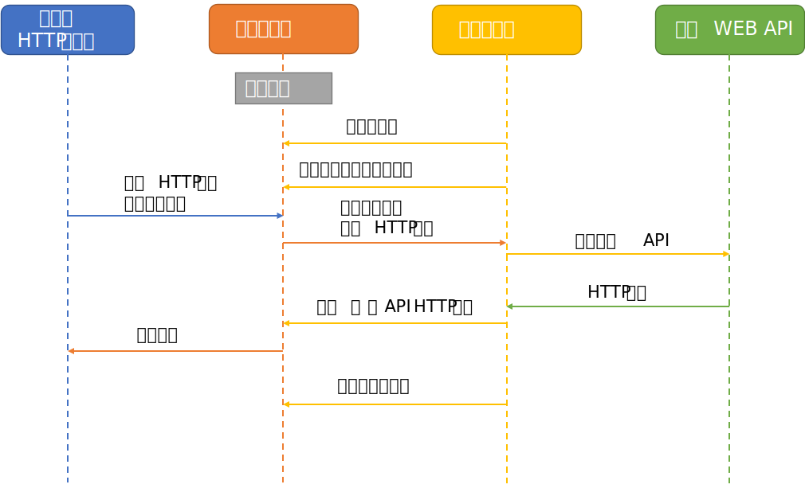

# 基于.NET原生Socket的WEB API转发工具(2) - 工具实现

## 功能介绍

最近了解了[TCP协议](https://colasaikou.com/2020/07/29/Socket-1.html)以及Socket编程的相关知识，这次用*.NET*平台提供的原生Socket类库实现一个简单的WEB API转发工具，功能示意：




## 使用方法：

首先在内网客户端定义好对外服务端的IP地址(`ServerIP`)，自身的项目ID(`GID`)，要转发到的内网API地址(`NATIP`)等内容

打开服务端，开启监听，在客户端点击连接服务器即可。之后所有对于服务端的Header带有对应`GID`的HTTP请求都会被转发到对应内网API，并原路转发回去


## 实现思路

首先，客户端接收到来自第三方服务器的HTTP报文的字节流


### HTTP协议

因为要转发HTTP请求，所以必须了解HTTP协议[^1]，另外因为本工具制定的自定义协议也是仿HTTP协议的，所以这里先重点介绍一下HTTP协议

```
GET /getdata HTTP/1.1
User-Agent: PostmanRuntime/7.26.2
Accept: */*
Host: 192.168.31.236:100
GID:00000001
Accept-Encoding: gzip, deflate, br
Connection: keep-alive
Content-Type: application/x-www-form-urlencoded
Content-Length: 1230

Data
```

一个完整的HTTP请求报文如图所示


| 内容   | 范围                                               | 含义                                                         |
| ------ | -------------------------------------------------- | ------------------------------------------------------------ |
| 请求行 | 上面第一行                                         | 从左到右标识这次请求的方法，url，HTTP协议版本                |
| 请求头 | 从`User-Agent`开始，一直到`Data`上面的回车换行结束 | 包含若干个属性，接收方根据这些属性获取请求方的信息           |
| 数据体 | *Data*的内容                                       | 数据部分，请求时携带的数据，可能是一些函数的参数，或者图片数据等 |

在`Data`上面的部分，即请求行和请求头部分是用`\r\n`，即回车符和换行符来分隔的


### 报文解析

都收到了报文了，直接转发不就行了，为什么要了解报文并解析呢，首先要了解一个概念

#### **TCP粘包**

众所周知，TCP协议是基于连接的，流式(STREAM)的传输层协议，数据在通信双方以字节进行传输，TCP是传输层协议 ，它不会关心报文携带的数据在应用层的具体含义，所以对于接收方的应用层来说，每次接收之后，缓冲区里的内容可能是多个有意义的应用层报文的集合，也可能是一个有意义的应用层的报文的一部分，即在我们看来，包可能被“粘”在一起，也可能接收到不完全的包，这就是粘包

关于TCP粘包是不是中式伪科学的问题，因为任何专业的教科书，以及官方文档，从来没有说过TCP会存在“粘包”的问题。在网上有很多讨论，主要关注点在于，TCP是传输层协议，所以这里的粘包，到底能不能称为“TCP粘包”，我认为没有必要纠结这个说法，只要知道这里指的是基于TCP协议的应用层协议，在业务逻辑上发生的粘包就行了

#### 使用代码解析报头

如何解决粘包问题，答案很简单，就是让接收方知道报文的边界在哪里，知道每一个报文在什么时候结束。在HTTP协议中是这样做的，通常[^2]在报文中有一个`Content-Length`属性，指示了`Data`部分的字节长度，知道这个长度，就知道这次报文的数据部分有多少个字节

项目代码中，位于`MessageFactory.cs`文件的`InitMessageFromData`函数体现了HTTP协议在代码中是如何解析的，因为前面也提到了，本工具的其它协议也是在这里解析的，直接看代码如果比较混乱的话，了解思路就行

代码先将通过Socket接收到的字节流转换成本文，因为HTTP协议是用`\r\n`来分隔的，所以这里主要用了`StringReader`类来逐行读取报文数据，主要目的是得到请求头携带的`GID`和`Content-Length`，又因为请求头到正文之间有一个空白行的间隔，所以当读到一个空字符串的时候，就代表请求头读完了，这时候就可以知道这次HTTP请求的项目ID，以及数据体的长度了

#### 主要代码

> 对于报文头的解析，在工具中大体都是基于这个套路来进行的，这里写几句示例，展示如何读到HTTP报头中的`Content-Length`属性

```c#
// 将接收到的报文内容转换成字符串
var textContent = Encoding.UTF8.GetString(data);
// 实例化StringReader，用于逐行读取数据
StringReader stringReader = new StringReader(textContent);
int contentLength = 0;

string line = "";

// 开始解析头部
while (line != null)
{
    // 读到当前行
    line = stringReader.ReadLine();

    // 当读到null表示后面一行都没了
    if (line != null)
    {
        if (line == "")
        {
            break;
        }
        else
        {
            var lineSplit = line.Split(':');

            if (lineSplit.Length >= 2)
            {
                // 获取头部长度
                if (lineSplit[0].ToUpper() == "CONTENT-LENGTH")
                {
                    int.TryParse(lineSplit[1].Trim(), out contentLength);
                }
            }
        }
    }
}
```

#### 解析报头的作用

其实关于报头的作用，在前面已经说得很明白了，这里再进行总结一次，通过解析报头，可以知道报文的边界，从而拆分得到的字节流，方便进行后续操作


### 业务逻辑

#### 前期准备

1. **与第三方的约定**：第三方HTTP报头需要携带项目ID(`GID`)属性来请求，否则我们无法判断要发往的客户端
2. **与客户端的约定**：客户端要使用正确的协议发送登录指令到服务端，从而标识自己的身份，让服务端在接收到第三方请求之后有地方可发


#### 服务端收到报文的后续处理(最开始功能图的详细实现)

1. **获取第三方HTTP报文**：通过解析第三方HTTP请求报头，判断是否需要截取或者拼接字节流，此时，我们得到了完整的，正确的HTTP报文
2. **构建服务端报文并转发**：判断第三方HTTP报文头是否携带了项目ID(`GID`)，并且当前连接服务端的客户端中有没有与之对应的，如果找到，使用服务端协议来再次包装这个HTTP报文，在其前面加上特定的服务端报头，标识了发送方的IP地址和端口号
3. **客户端接收并转发**：客户端接收到来自服务端的报文之后，解析出HTTP报文，转发给界面上设置的内网API
4. **客户端转发API响应**：客户端得到内网API的响应报文之后，解析并且用客户端协议来再次包装这个响应体，在前面加上特定的客户端报头，标识了要响应的目标IP地址和端口号
5. **服务端转发客户端响应**：服务端接收到来自客户端的报文之后，解析出HTTP响应报文，找到当前连接中IP和端口号与客户端响应报头上相同的，转发回去


## 其它要点

客户端和服务端均是用`Winform`构建，除了解析报文部分之外，主要用到了自定义的`Session`类来管理连接，`Session`是Socket的扩展，在Socket的基础上加了业务需要的属性和函数，程序通过管理一个`Session`列表来管理所有连接

在客户端和服务端通过`心跳`机制来维持连接，默认每分钟客户端向服务端发送心跳，当超过2分钟没有发送心跳时，连接断开


## 自定义协议内容

> 协议的形式都是和HTTP协议一样的，以最上面一行请求行作为每个报文的开始位置，按照一样的模式来解析就行了

### TCP客户端的登录报文：

```
2136@208140@8111
GID:00000001

```

### TCP客户端=> 外网Server报文

```
18587!303&315434
IP:127.0.0.1:80
Content-Lenght:1000

data(长度1000)

```

### TCP客户端心跳包

```
32906%9041@89176

```

### 外网Server => TCP客户端报文

```
18587!303&315434
IP:127.0.0.1:80
Content-Lenght:1000

data(长度1000)

```


[^1]: 如果对于协议一词还有疑惑，又不想深究的话，可以理解成，协议是网络通信双方约定好的一种发送数据的规范，就好像是人与人之间对话用的语言，只有用对方听得懂的语言，听的人才知道说出来的一堆音节组成的一句话在什么时候说完，具体含义是什么，从而做出回应。双方默认以这个规范构建和解析信息，从而可以正确处理消息的内容，判断后续操作(截取，转发，断开连接等)
[^2]: 在HTTP报文中，当然也存在不携带`Content-Length`属性的情况，当不携带时，可能是`Data`部分不携带任何数据，也有可能是分包发送的`Chunked`报文，这些在代码里也有考虑，这里只讨论一般情况